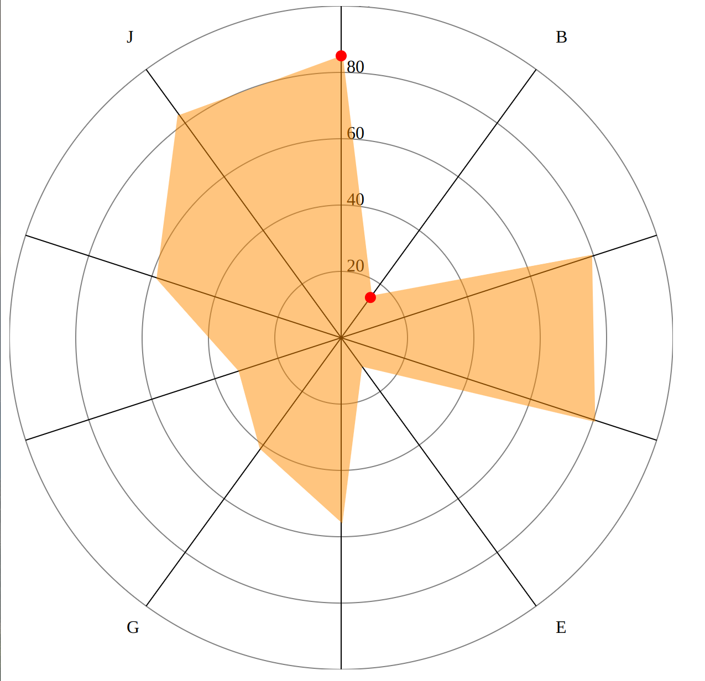
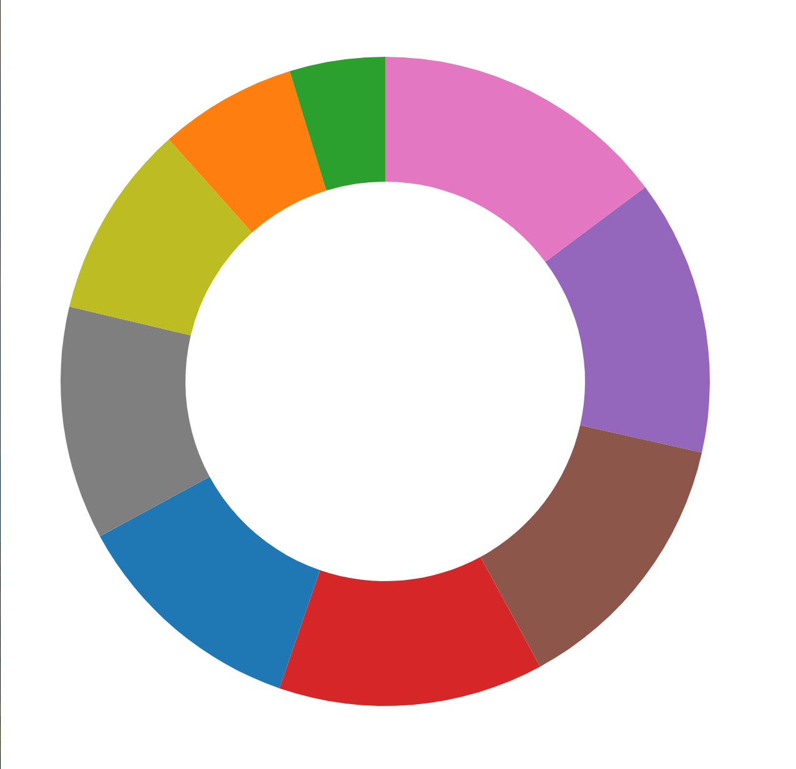
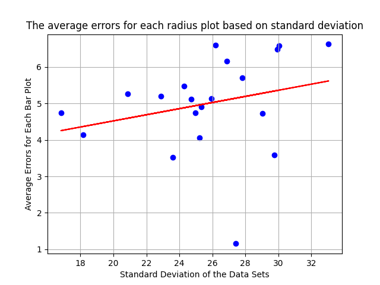
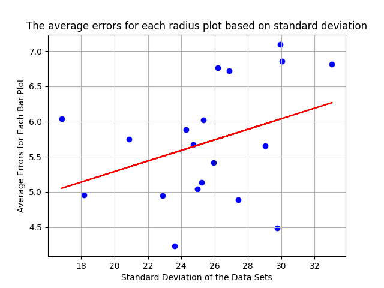

# Technical Achievements
 - extra participants (collected data from 23 participants, analyzed 18 due to time constraints)
 - analysis based on standard deviation
 - dataframes representing the results and errors in a comprehensive/usable manner

# Design Acheivements
- modifications to the basic visualization types to fit the experiment needs
- front end for the project https://github.com/m-saint/study.git

# Contributions
- Taya: analysis, write up, bar chart code, generated all viz, recuruit participants + collect data
- Myles:
- Ash:

# Experiment Details
We ran the experiment using three types of visualizations: bar chart, radar chart, and donut chart. We chose the bar chart since it is the most common way to represent simple numbers and relathionships between them. Moreover, the original experiment used a bar chart and it would've been interesting to see how our results compare to those in the paper. We chose a radar chart since it is a fairly unconventional way to represent a simple array of numbers and it would be interesting to see how the accuracy measured compared to that of a bar chart. The donut chart is perhaps the most unconventional of the ways to represent our data and we thought it would be interesting to see if it all the sections might make it easier for the participants to see the percentages. 

Out study generated a static list of 20 arrays which were used to create 20 examples of each of the visualization types thus resulting in 60 separate images. The code for data generating is under data/generateData.py

The participants were asked the questions in the following format: "What is the percent difference between the data points labeled with a dot?". The participants were asked not to spend too much time looking at the graphs and eyeball their guesses. 

## Chart Details
Below are some important details on implementation of each of the visualization types which affected the outcomes of the experiment. All the charts were generated using the same data sets as mentioned above. For example, bar plot 1, radar plot 1, and donut plot 1 are all based on the same data set and so on. The consistency in using the same data sets for each individual visualization type allows for more meaningful error comparissons at the end of the experiment. The values for comparisson were always the first two values of a given dataset.

### Bar Charts
The bar charts were of the following format . See the barChart/charts folder for the graphic representations of all of the charts used. 
The bars are outlined in dark blue and coloured with light blue. The red dots indicate the two bars which the trial participants needed to compare. The bars are spaced evenly with small gaps in between. The chart also contains a scale on the left hand side. All of these additions to the chart were made to test the following hypothesis:
- The high contrast of blue and red results in more accurate percent difference guesses
- The number scale on the left makes it easier to make educated quantitative guesses

### Radar Charts
The radar charts were of the following format . See the radarChart/charts folder for the graphic representations of all of the charts used. 
The radar chart contains the number scale in the  middle similar to that of the bar charts above. The data points for comparisson are labeled with a red dot. The overall area is coloured in light orange. All of these additions to the chart were made to test the following hypothesis:
- The low contrast between the area colour (orange) and the dots (red) makes it more difficult to find an accurate percent difference
- The number scale makes it easier to make an educated guess about the percent difference
  
### Donut Charts
The donut charts were of the following format . See the donutChart/charts folder for the graphic representations of all of the charts used. 
The donut charts were not labeled in any way, in contrast to the two visualizations above, other than the default colour labels for each section representing each number in an individual dataset. The donut chart was not labeled with red dots to indicate which values are to be compared. Instead, the participants were asked the comparisson questions in the following format: "What is the percent difference between the BLUE and PINK sections?". The coloured sections next to one another varied in contrast and surface area based on the values provided. All of these additions to the chart were made to test the following hypothesis:
- Lack of labels makes it more difficult to accurately guess the percent difference
- Each data point having its own colour is distracting and thus makes it more difficult to make an educated guess
  
## Overall Hypothesis
The bar chart is the best way to represent simple numerical data. 

## Results
### Quantitative Results
All the results are located under analysis folder. The analysis.py is the detailed Python code used to produce the result graphs below (please change the file paths if that files needs to be run). Some details on other files: 
- master.csv contains all the raw responses from 18 participants.
- cleanedData.csv contains the numerical data used to calucalte all the errors. Some results were removed and reformated to suit the needs of error analysis. See analysis.py code comments for details on data cleaning. The NaNs were replaced with -1 which affected the relative average calculations. 
- radiusChartWithErrors.csv all the collected data and individual errors calculated for each sample for radius charts
- barChartWithErrors.csv all the collected data and individual errors calculated for each sample for bar charts
- donutChartWithErrors.csv all the collected data and individual errors calculated for each sample for donut charts

The errors for each of the three types of visualizations are as follows. The errors were calculated using the formula provided in the original paper. Moreover, each of the results was compared based on calculating the average error for each sample of each visualion and graphing those points against the standard deviation of the dataset represented. 

The average error for the bar plot visualization was 4.843618569048888.

The average error for the radius plot visualization was 4.996302450444299.

The average error for the radius plot visualization was 5.705429116964277.

The errors for the bar plots in relation to each data set represented .

As indicated by the line of best fit, higher standard deviation of a dataset results in larger errors. Although the slope is reltively low, indicating a weaker relathionship between standard deviation of a data set and errors made. Notice that the plot has one outlier which is most likely due to errors in reponses. 

The errors for the radius plots in relation to each data set represented .
Similar to the bar plot above, we see a positive correlation between standard deviation and error. In comparisson to the bar chart, we have a high slope indicating a stronger relathionship between the two variables. Similarly to above, we have one outlier likely due to errors in reponses.

The errors for the donut plots in relation to each data set represented .
Similar to the two plots above, we have a strong positive correlation between the standard deviation of a data set and error. However, the errors for the donut plot are a lot more distributed than the ones for bar and radar plots. We have a few more outliers likely indicating that reponse errors were more prominent due to the visualization type. 

Overall, the errors were high across every type of visualization (see qualitative results section for potential explanations). However, the patterns displayed in the three graphs above confirm the hypothesis that bar charts are the overall best way to represent simple numerical data with the radius chart being a close second.
### Qualitative Results
After taking the survey some participants provided feedback. The key points are below: 
- The survey had 60 questions and thus was too long which may have caused pariticpants to loose interest and be less attentive towards the end. Thus, the higher error for the donut chart may be attributed to this feedback.
- Calculating the percent difference by eyeballing it is fairly difficult since it is not a common task performed on graphs. This feedback explains some outliers in the results and indicates the difficulties in understanding the questions given.
